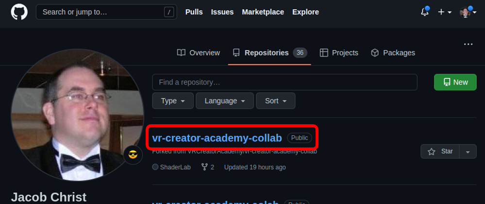
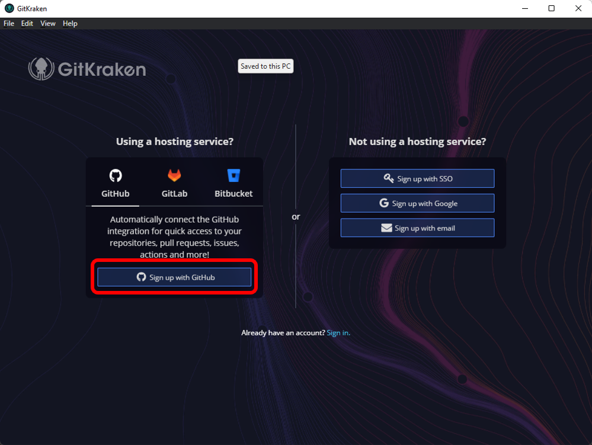
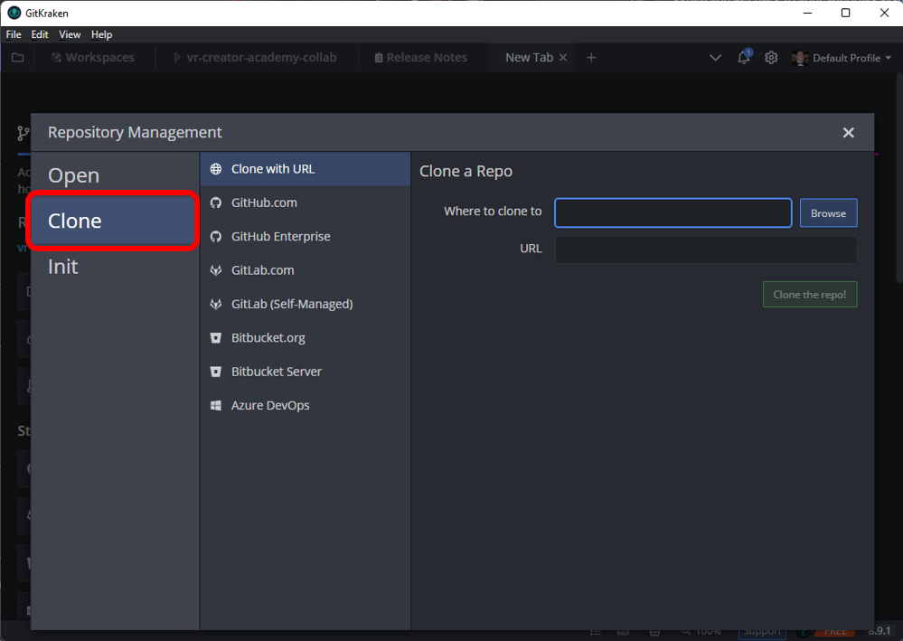
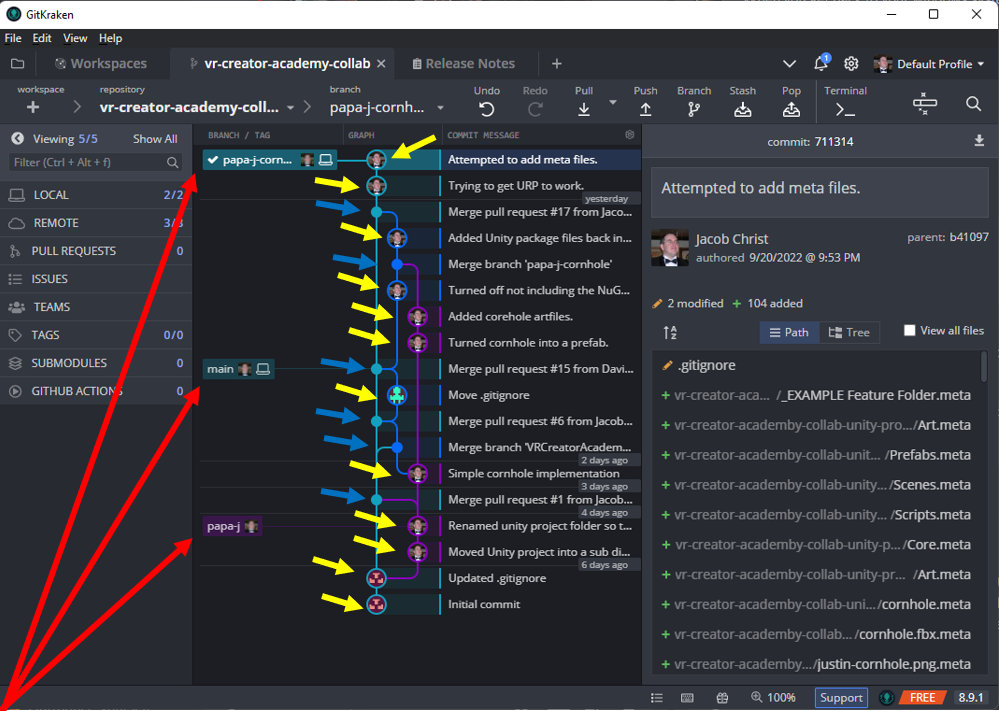
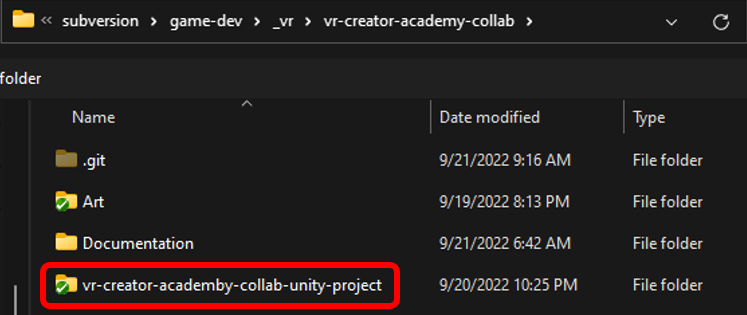
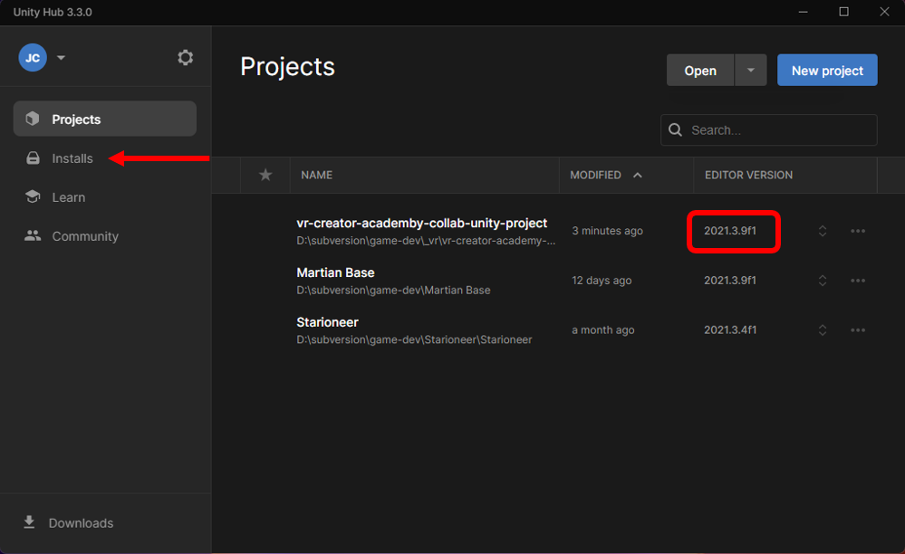
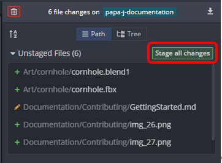
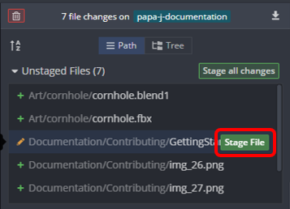
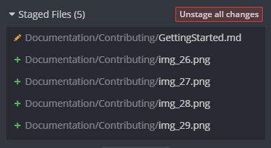
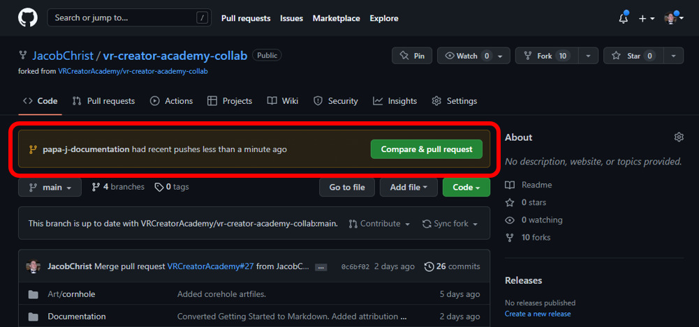

# Getting Started Working and Contributing
The purpose of this guide is take someone that has never contributed to open source project from noob to contributor in 
as little as time possible while putting as little effort as possible into the documentation as possible.  Specifically
to allow them to start contributing to the
[VRCreatorAcademy/vr-creator-academy-collab](https://github.com/VRCreatorAcademy/vr-creator-academy-collab) project.
As a result, it is very terse and probably lacking at every point in the document.

# Git Terminology
At this point you should not read the 
[Git Terminology](https://github.com/VRCreatorAcademy/vr-creator-academy-collab/blob/main/Documentation/Contributing/GitTerminology.md)
document, but it has been provided in case you hear a term you don't know.  It might be good to open this page in a 
different window and have it handy while reading this document. 

# How to Fork the Repo and Copy the Repo URL
1.	Sign up for a github.com account (if you do not already have one) and login.
2.	Get a git client tool to use on your computer.  There are many here are a few:

| Tool                           | Platform(s)   | Cost  | Note                                                     |
|--------------------------------|---------------|-------|----------------------------------------------------------|
| gitk  & git gui                | Win/Mac/Linux | Free  | Original git graphical user interface                    |
| https://tortoisegit.org/       | Win           | Free  |                                                          |
| https://www.sourcetreeapp.com/ | Win/Mac       | Free  |                                                          |
| https://www.gitkraken.com/     | Win/Mac/Linux | Free* | Free for public repos only and used in this document **  |

All git clients do pretty much the same thing and all the necessary features to work with a repo are supported in all
of the above clients.  The reason GitKracken was chosen for this document is that it works on all operating systems for
public repositories.  I (Jacob Christ) personally do not use GitKraken because it does not work on private repositories
without paying for it and I don't have a Mac so I have other options.  When I'm in Windows I use Tortise Git and when I
am in Linux I use gitk, git gui and command line tools.

3.	Navigate to the upstream repo:
- https://github.com/VRCreatorAcademy/vr-creator-academy-collab
- An upstream repo is one that you will be contributing changes to that from your personal fork.
4.	Click on the fork button to make your personal fork of this repo:

  - 

5.	You will now have your very own for of the repo in your github account. Click on the repo (notice that it is a Public repo which means that the world can see it).

  -  

6.	Click on the “Code” then “Copy” button to copy the URL for the repo into your copy buffer.

  - 

# How to use GitKraken to Clone the Repo to your Local Machine
What: GitKraken is a git client application.  Git clients are required to clone a repo (cloning means to copy the files from a remote computer to your local computer).
Why GitKraken: Its free for public repos and works on all Win/Max/Linux. Note: this may not be the best tool for the job but it’s a great tool for teaching because: free & cross platform.  Its okay to use a different git client and 
1.	Download and install GitKraken
2.	Sign up with GitHub (you should have an account)

  - 

3.	If it worked, it should redirect you to a “Success!” page in a web browser.  If it didn’t work it looks like there is some way to copy a token and paste it into GitKraken.  This “Copy Token” button it beyond the scope of this document.

  - 

4.	Create a profile: I just took the default values that it retrieved from github.com by clicking the “Create Profile” button:

  - 

5.	Choose “Start with a Repo Tab”

  - 

6.	Select Clone a Repo:

  - 

7.	Paste the URL obtained from the previous procedure into the URL text box and choose where you want to store the cloned repo on your local computer.

  - 

8.	Click “Open Now” to see your newly cloned repo:

  - 

9.	Walla, your new repo:

  - 

These are branches, you can switch between them by double clicking on them.  If you double click on the main branch you will check it out.
The yellow arrows are commits
The blue arrows are merge points.  A merge is where two branches were merged.
10.	The icons to the right of the branch name indicate if the branch is local or remote.  The icon of the left is the remote computer branch and the icon on the right is the local computer branch.

  - 

# Opening The Project in Unity
1.	Open Unity HUB
2.	Click on down arrow next to the Open button then click on “Add project from disk”.

  - 

3.	Navigate to the cloned git repo.  The Unity project is in this sub directory, double click to enter the Unity project:

  - 

4.	Click the “Add Project” button:

  - 

5.	Take note of the Unity version. If you do not have the required version installed, then you need to click on the
install tab and install the require version. 

**WARNING: DO NOT OPEN THE PROJECT WITH THE INCORRECT VERSION OF UNITY**.

  - 

6.	Click on the project name to open the project in the Unity Editor.  You can now explore and make changes to the project.

## Contributing Back Your Changes
The process looks like this.  Make sure you are on the branch you want to contribute back to the repository.
- Open the project in Unity and make your changes.
  ### some good practices when working with others in Unity
    - Do not work on other people scenes.  If two people are working on the same scene and a merge is need it is likely 
that the merge will not go well and someone will lose work. Here is a better process:
        - Duplicate a scene you want to work on (shi) and put your name on it.  
        - Add what you need to the scene and make a prefab.
        - Modify code (this will merge easily).
        - 
  - When you are ready to commit save every 
- Go to your git client (GitKraken) and choose the file you want to stage or click the "Stage all changes" button to choose all file.:
  - Staging your changes allows you select which files you have modified that you want to commit to the repository.  
  - 
- Once you have staged some file you have the option to unstage files.
  - This is your last chance to change your mind before you commit.  If everything looks good move on to the next step.
  - 
- Go to your git client (GitKraken) and commit your changes:
  - be sure to make a summary note of why you did what you did

[How to make a commit with GitKraken](https://www.youtube.com/watch?v=9YCO-3_MApI) (Very good YouTube Video)
- Push the changes to your fork.  
  - 
- Once they are on your fork, navigate to github.com/YourUserName/YourFork web page.
- You should see the "Compare & pull request" at the top of your repo.
  - If you changed branches you made need to select the branch name on the branch pull down.
    - If you haven't changed branches you will probably bin on "main"
      - This guide assumes you haven't changed it yet.  
- Push the "Compare & pull request" button
  - 

# Where to go from here
- If your having trouble fetching, code from other contributors mae sure your fork is synced with the upstream project 
by cliking on the "Sync fork" button on your github fork page.

- The [GitKracken YouTube](https://www.youtube.com/c/Gitkraken) page has a lot of good video on how to use the tool.
- Ask question in Discord collab-project channel.
- Make an awesome VR game.
 
# Windows Hidden File Extensions (Optional)
If you are using Windows and you have gotten this far you might want to consider making these changes:

[How to show Windows file extensions](https://github.com/VRCreatorAcademy/vr-creator-academy-collab/blob/main/Documentation/Contributing/WindowsHiddenFileExtensions.md) 