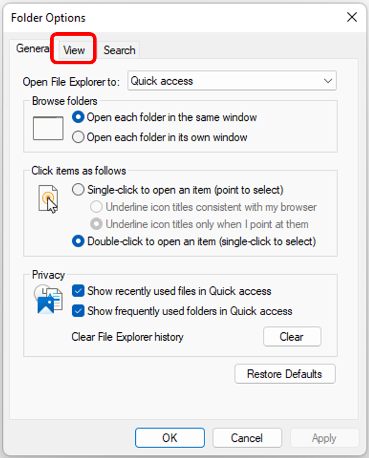

# Windows Hidden File Extensions (Optional)
In ancient history file names on Windows / DOS computer were limited to eight characters a dot and then three more 
characters.  These are known today as 8.3 filenames.  The first eight characters are the name of the file and the 
last three character are known as the extension.  The extension is a code that is used to identify the type of file
(what kind of data and how it is stored).  Microsoft introduced long file names (LFN) in Windows 95 (Yay!) as well 
as a patent for the technology for making LFN’s work with 8.3 file names (Boo, though the patent has since expired).
The long file names broke the 8.3 limitations for both the name and the extension.  Somewhere along the line started
Windows started suppressing the file extension when it didn’t know what it meant.  The extension is still there but 
you can’t always see them as seen here:

In the above image Windows doesn’t know what a .blend1 nor a .fbx file types are so it displays the extension.  
However, it does know what a .blend, .png and a .xcf file are and thus it suppresses the extension and doesn’t show 
it.  It does show a description in the “Type” column but not the extension itself.
I find this utterly confusion and more than slightly frustrating.  The good news is they do provide a method for 
turning off a feature that I do not want.  And I highly recommend for any software developers out there to turn this 
feature off to save confusion and frustration.  Luckily its quite easy to turn off.  Here is how to do it.
1.	In the file explorer click the three dots dropdown:

2.	Click on the “Options” option:

 
3.	Click on the “View” tab:

4.	Finally, we can access the thing Microsoft is trying to protect you from:

I recommend changing the following settings:
1.	Set Hidden files and folder to: “Show hidden files, folders and drives”
a.	Why: Sometimes hidden files are created that are needed by your application.  If the files are hidden in the file explorer and you are trying to copy your program to another folder they may not come along and prevent your program from working.
2.	Turn off “Hide extensions for known file types”
a.	Sometimes you will need to create or rename a file with a given extension.  If the extension is hidden you cannot alter it.  This leads to the following problems.
i.	Rename from program.c to program.cs: Since you cannot access the extension you cannot change it.
ii.	Create a file called program.cs.  This file got created and it looks like it has a .cs extension but its really a .txt file:

3.	Turn off “Hide protected operating system files (Recommended)
a.	Windows programs use shared libraries called “DLL”’s (Dynamic Linked Libraries).  If these are hidden in the file explorer and you are trying to copy your program to another folder they may not come along and prevent your program from working.
b.	When you turn this one off Windows really trys to convince you not to do it with the following message:

c.	Just click “Yes”.
4.	When complete you can see the real name of the file we tried to create above:

5. Finally, we can rename it to the proper extension of .cs to which Microsoft will now give us a warning:

6.	Now look at that, the file has the right extension and Windows still know what file type it is:

